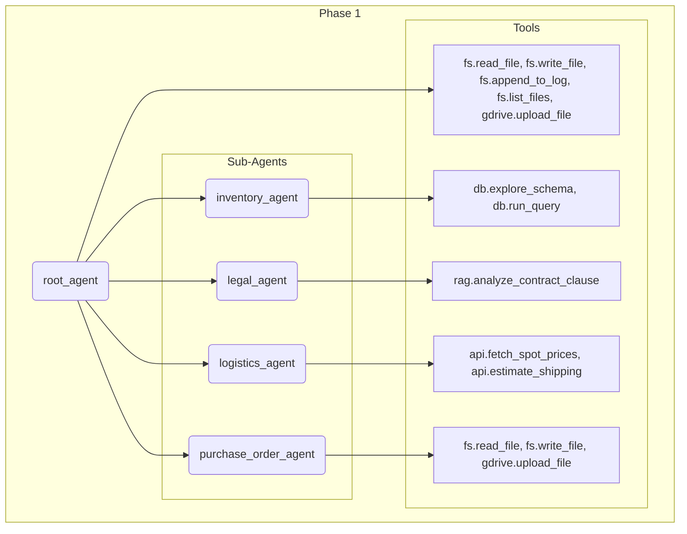
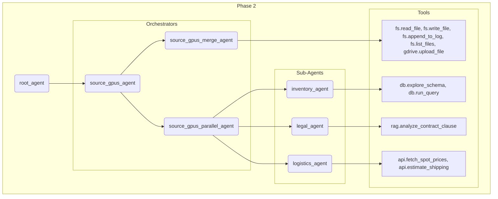
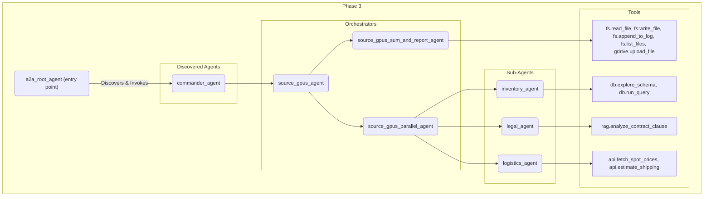

# 🛠️ Environment Setup

## Step 1: Login to Google Cloud with Adequate Scopes

See [FIX_GDRIVE_AUTH.md](/docs/FIX_GDRIVE_AUTH.md) for justification around scopes.

```bash
gcloud auth application-default login --scopes=https://www.googleapis.com/auth/drive.file,https://www.googleapis.com/auth/userinfo.email,https://www.googleapis.com/auth/cloud-platform
```

## Step 2: Deploy Cloud Resources

Deploy Resources via Makefile:
```bash
make deploy project=YOUR_PROJECT_ID
```

## Step 3a: Run a Live Demo for a given Phase

To run a specific demo phase, use the **make run** target with the lab sub-folder sub-folder/phase input.

```bash
make run lab=YOUR_LAB_PHASE_FOLDER
```

For example, for labs/phase1:

```bash
make run lab=phase1
```

## Step 3b: Run a Headless Test for a given Phase

To run a headless test for a specific demo phase, use the **make test** target with the lab sub-folder/phase input.

```bash
make test lab=YOUR_LAB_PHASE_FOLDER
```

For example, for labs/phase1:

```bash
make test lab=phase1
```

## Step 3c: Run a Headless Batch Test for all Phases

To run a headless test for all phases, use the **make batch-test** target with the specific count.

```bash
make batch-test count=YOUR_LAB_PHASE_FOLDER
```

For example, for 10 test runs for each lab:

```bash
make batch-test count=10
```

## Step 4: Destroy Cloud Resources

Destroy Resources via Makefile:
```bash
make destroy
```

# 🛠️ Environment Phase Overview

## Common Cloud Infrastructure Resources


## Phase 1 Agents and Tools



## Phase 2 Agents and Tools



## Phase 3 Agents and Tools


